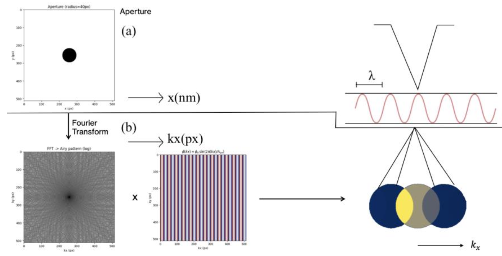
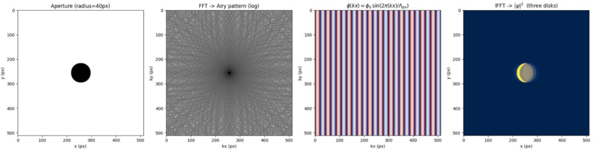

# 4D-STEM Phase Reconstruction

Computational analysis and phase reconstruction for **4D Scanning Transmission Electron Microscopy (4D-STEM)** using Fourier optics and Python.

Developed as part of my **Physics & Astronomy** degree at the **University of Glasgow**.

---

## Overview

This project investigates computational methods used in 4D-STEM image processing.

The original research focused on modelling diffraction patterns, applying phase modulation in reciprocal space and reconstructing electron wave functions using Fourier optics.

The work combines numerical simulation, signal processing and scientific visualisation.

---

## Features

- Fourier Transform (FFT) image processing
- Phase modulation in reciprocal space
- Inverse Fourier reconstruction
- Diffraction pattern analysis
- Beam shift analysis
- Scientific data visualisation
- Numerical modelling in Python

---

## Technologies

- Python
- NumPy
- SciPy
- Matplotlib

---

## Example Results

### Phase reconstruction

<p align="center">
  
</p>

### Diffraction pattern analysis

<p align="center">
  
</p>

---

## Scientific Background

4D-STEM (Four-Dimensional Scanning Transmission Electron Microscopy) records a complete diffraction pattern at every probe position, producing high-dimensional datasets that enable quantitative phase reconstruction and advanced materials analysis.

This project explores computational techniques for analysing these datasets using Fourier-based methods.

---

## Repository Structure

```
4d-stem-electron-microscopy
│
├── src
│   └── main.py
│
├── figures
│
├── docs
│
├── requirements.txt
│
└── README.md
```

---

## Why only a simplified version?

The complete research implementation was developed as part of university coursework and is intentionally **not included** in this public repository.

This repository contains a simplified demonstration illustrating the computational methods and representative scientific results while protecting the original research implementation.

---

## Author

**Daria Aksianova**

Physics & Astronomy (BSc Hons)

University of Glasgow
